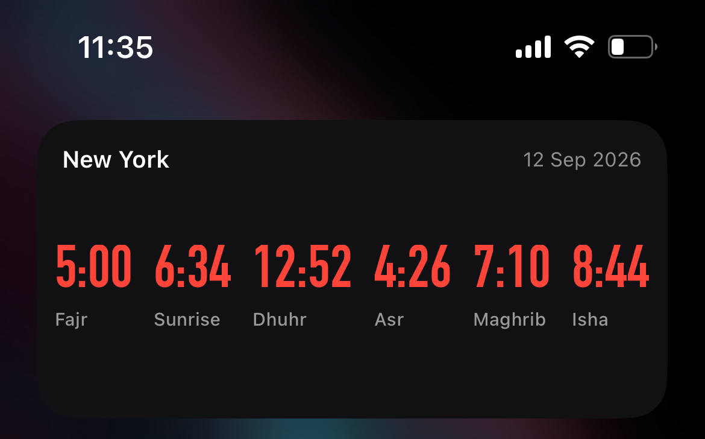

# Azan Widget

An iOS home-screen widget (via [Scriptable](https://scriptable.app)) that shows the day's five prayer times plus sunrise, for a location you pick from a saved list. Built for quickly checking azan timings without googling "location azan time" every time.



## Features

- Shows **Fajr, Sunrise, Dhuhr, Asr, Maghrib, Isha** for the current day, in a compact horizontal layout.
- Switch between saved locations by tapping the widget.
- Falls back to the last cached times if there's no internet connection.
- Refreshes once per day (around midnight) instead of repeatedly throughout the day, since prayer times don't change intraday.
- Uses the free [Aladhan API](https://aladhan.com/prayer-times-api) — no ads, no account, no tracking.

## Requirements

- iOS with the [Scriptable app](https://apps.apple.com/app/scriptable/id1405459188) installed (free).

## Installation

1. Install **Scriptable** from the App Store if you don't already have it.
2. Open Scriptable and tap **+** to create a new script.
3. Copy the contents of [`Azan Times.js`](./Azan%20Times.js) into the new script.
4. Rename the script to **`Azan Times`** (tap the title at the top). This name must match, since it's how iOS links the widget to the script.
5. Run the script once inside the app (tap ▶️) to pick your first location.
6. Long-press your home screen → **+** → search **Scriptable** → add the **Medium** size widget.
7. Long-press the widget → **Edit Widget**, and set:
   - **Script**: `Azan Times`
   - **When Interacting**: `Run Script`

## Configuring your locations

Open the script in Scriptable and edit the `LOCATIONS` array near the top:

```js
const LOCATIONS = [
  { name: "New York", lat: 40.7128, lon: -74.0060 },
  { name: "London", lat: 51.5074, lon: -0.1278 },
  { name: "Tokyo", lat: 35.6895, lon: 139.6917 },
];
```

Add, remove, or edit entries as needed. Coordinates for a place can be found by searching for its name on Google Maps and reading the lat/lon shown in the URL or share sheet.

## Fonts

Times are rendered with `new Font("DINCondensed-Bold", 28)`. This is a custom font name, not one of Scriptable's officially documented `Font.*SystemFont()` calls, so it isn't guaranteed to be present on every device — if it fails to load, iOS will silently fall back to a default font instead of erroring. If you'd rather use a guaranteed system font, swap that line for something like:

```js
time: Font.blackSystemFont(24),
```

## Calculation method

Uses **University of Islamic Sciences, Karachi** (Aladhan method ID `1`). To change it, edit the `METHOD` constant near the top of the script. Common alternatives:

| Method | ID |
|---|---|
| Muslim World League | 3 |
| Islamic Society of North America (ISNA) | 2 |
| Umm Al-Qura University, Makkah | 4 |
| Egyptian General Authority of Survey | 5 |
| Dubai | 16 |

Full list: [Aladhan API docs](https://aladhan.com/prayer-times-api#GetTimings).

## Usage

- The widget shows timings for whichever location is currently selected.
- **Tap the widget** to open a picker and switch locations — your choice is saved and used for future widget refreshes. (There's no on-widget hint text for this by design, to keep the layout minimal — it's a one-time thing to learn.)
- The widget hints to iOS that it only needs to refresh once the day changes (`refreshAfterDate`), since prayer times are fixed for the whole day. iOS may still refresh earlier at its own discretion — this is a hint, not a guarantee — but it meaningfully cuts down on unnecessary refreshes. Opening the widget/app manually always forces an immediate refresh.

## License

MIT — see [LICENSE](./LICENSE).